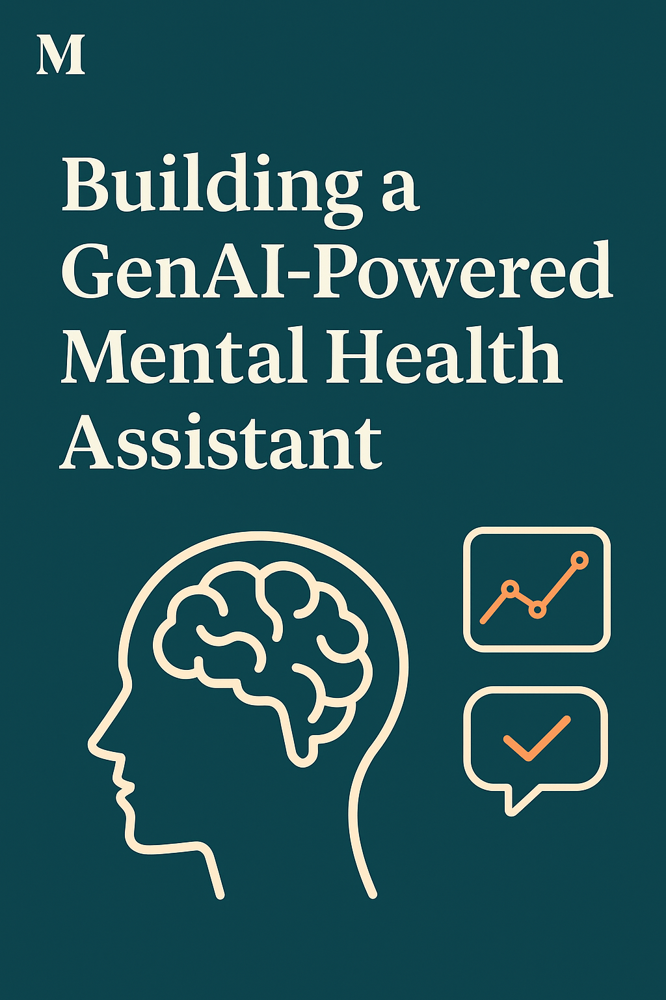

<a href="https://www.linkedin.com/posts/soumyajit4119_genai-capstoneproject-mentalhealthmatters-activity-7319930896139063297-XDRZ?utm_source=social_share_send&utm_medium=member_desktop_web&rcm=ACoAAD4UacEBbRVPjQfgQ7U17qu9DZGoXfe-D1Y"></a>
<a href="https://medium.com/@soumyajit302/harnessing-generative-ai-for-mental-health-support-my-capstone-journey-d386136e0f2a"></a>

# A GenAI-Powered Mental Health Assistant 🤖

Welcome to **Daily Journal Analyzer**, a Generative AI-powered mental wellness assistant that helps you reflect, track, and grow through intelligent journal analysis. Designed as part of my capstone project for the Gen AI Intensive Course, this tool blends emotional awareness with cutting-edge GenAI to make journaling a more insightful and helpful experience.

<br>

## 🚀 Project Overview

In today’s fast-paced world, journaling has emerged as a simple yet powerful tool to reflect on our thoughts, manage stress, and monitor emotional well-being. However, it’s often difficult for individuals to objectively interpret their own writing or derive actionable insights from it.

This notebook introduces a lightweight **Generative AI-powered Daily Journal Analyzer**, built using **Google’s Gemini API**. With just a short paragraph of text describing how your day went, the assistant provides a structured emotional analysis including:
- Mood classification
- Emotional tone and confidence
- Key thought patterns
- Mental health suggestions

Unlike traditional machine learning solutions, this project does **not require any dataset, training, or labeling**. Instead, it leverages **few-shot prompting**, **structured output (JSON mode)**, and the **Gemini LLM** to extract meaningful insights from unstructured text in real time.

> 💡 **Note:** This project is intended for educational use and self-reflection. It is **not a substitute for professional mental health support.**

<br>

## 📂 Project Structure

```
📁 My-GenAiCapstoneProject/
│
├── my-genaicapstoneproject.ipynb        # The main Jupyter notebook
├── requirements.txt                     # Required Python packages with versions
├── assets/
│   └── banner_linkedin.png              # Banner image of Linkedin 
|   └── banner_medium.png                # Banner image of Medium

```

<br>

## 🧪 Features
Specifically, this Ai powered assistant will:

- Accept **natural language journal entries** as input  
- Use **few-shot prompting** to guide Gemini’s understanding of emotions  
- Return a **structured JSON response** containing:
  - Overall **mood classification** (e.g., positive, negative, neutral)
  - Detected **emotional tone** (e.g., stressed, content, anxious)
  - Detected **confidence score** and **stress level** (e.g., high, low)
  - Brief analysis of the user's **self awareness**
  - **Important words** related to mood or triggers
  - **Key thought patterns** extracted from the entry
  - **Actionable suggestions** to improve mental well-being in the analysis

The tool demonstrates how **Generative AI** can be used as a supportive mental wellness assistant, even with zero external data and minimal coding effort — making it accessible and practical for real-world use.

<br>

## 🧠 **GenAI Capabilities Used**

This project demonstrates the practical use of multiple Generative AI capabilities, integrated seamlessly using Google’s Gemini API:

| ✅ Capability                     | 💡 How It’s Used                                                                                                       |
|-----------------------------------|------------------------------------------------------------------------------------------------------------------------|
| **Structured Output (JSON Mode)** | The AI returns a consistent, machine-readable JSON response with fields like mood, tone, suggestions, etc.             |
| **Few-shot Prompting**            | Carefully crafted prompt includes example journal entries and expected JSON-format responses.                          |
| **Function Calling (Simulated)**  | The model acts like a callable function: input journal → output structured insights, without defining custom functions.|
| **Long Context Window**           | Gemini can process long journal entries while preserving coherence in the analysis.                                    |

⚠️ Note: While **Embeddings**, **Vector Search**, or **RAG** are not used in this project, the architecture can be extended to include them in future iterations (e.g., tracking mood trends over time).

<br>

## 📌 How to Use

1. **Clone the repository**  
   ```bash
   git clone https://github.com/Soumyajit4119/My-GenAiCapstoneProject.git
   cd My-GenAiCapstoneProject
   ```

2. **Install dependencies**  
   ```bash
   pip install -r requirements.txt
   ```

3. **Add your Gemini API Key**  
   Store your API key securely using `kaggle_secrets` or environment variables.

4. **Open the notebook**  
   Run `my-genai-capstone-project.ipynb` on [Kaggle Kernels](https://www.kaggle.com/code) or Jupyter.

5. **(Optional)** Uncomment the sample simulation cell to preload journal history and visualize mood trends.
   ```python
    sample_journal_texts = [
      "Had a productive morning but felt overwhelmed by college deadlines.",
      "Went out with friends after a long time. Felt good and relaxed.",
      "Couldn’t sleep well last night. Mind was restless and I kept overthinking.",
      "Completed most of my tasks today. Feeling accomplished and calm.",
      "Felt anxious and irritable all day for no clear reason.",
      "Spent the afternoon reading and enjoying the quiet. It helped me feel centered."
   ]
    ```

<br>

## 📊 Example Output
```entry = "I couldn’t focus at all. Everything feels off, and I’m getting anxious about the upcoming exams."```

```json
{
  "mood": "negative",
  "emotional_tone": "anxious",
  "confidence": 0.87,
  "stress_level": "High",
  "self_reflection": "User recognizes their struggle with focus and anxiety, indicating self-awareness.",
  "keywords": ["focus", "anxious", "exams"],
  "key_thoughts": "User is feeling overwhelmed and stressed about academics.",
  "suggestions": "Take short breaks, practice deep breathing, and focus on one task at a time."
}
```

<br>

## 🔮 Future Updates

- Personalized coping suggestions based on recurring patterns
- Voice-to-text journaling for accessibility
- Secure cloud storage for cross-device journaling
- Recommendations of mental health resources

<br>

## 📜 License

This project is for educational purposes. All AI analysis is intended to assist with self-reflection and is not professional mental health advice.
